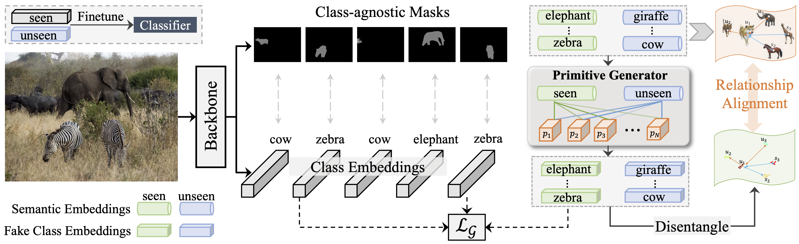

# Primitive Generation and Semantic-related Alignment for Universal Zero-Shot Segmentation
[](https://pytorch.org/)
[](https://www.python.org/downloads/)

**[🏠[Project page]](https://henghuiding.github.io/PADing/)** &emsp; **[📄[arXiv]](https://arxiv.org/abs/2306.11087)**  &emsp; **[📄[PDF]](https://openaccess.thecvf.com/content/CVPR2023/papers/He_Primitive_Generation_and_Semantic-Related_Alignment_for_Universal_Zero-Shot_Segmentation_CVPR_2023_paper.pdf)**

This repository contains code for **CVPR2023** paper:
> [Primitive Generation and Semantic-related Alignment for Universal Zero-Shot Segmentation](https://openaccess.thecvf.com/content/CVPR2023/papers/He_Primitive_Generation_and_Semantic-Related_Alignment_for_Universal_Zero-Shot_Segmentation_CVPR_2023_paper.pdf)  
> Shuting He, Henghui Ding, Wei Jiang  




## Installation:

The code is tested under CUDA 11.2, Pytorch 1.9.0 and Detectron2 0.6.

1. Install [Detectron2](https://github.com/facebookresearch/detectron2) following the [manual](https://detectron2.readthedocs.io/en/latest/)
2. Run `sh make.sh` under `PADing/modeling/pixel_decoder/ops`
(Note: 1-2 steps you can also follow the installation process of [Mask2Former](https://github.com/facebookresearch/Mask2Former))
3. Install other required packages: `pip install -r requirements.txt`
4. Prepare the dataset following `datasets/README.md`

## Inference

```bash
CUDA_VISIBLE_DEVICES=0 python train_net.py \
    --config-file configs/panoptic-segmentation/PADing.yaml \
    --num-gpus 1 --eval-only \
    MODEL.WEIGHTS [path_to_weights] \
    OUTPUT_DIR [output_dir]
```

## Training

Firstly, download the pretrained weights [here](https://drive.google.com/drive/folders/1ynhW1vc_KpLQC_O1MrSuRt4dn8ZYTwa4?usp=sharing) or you can train vanilla mask2former backbone using seen classes and convert it using the following command:

```bash
python train_net_pretrain.py --config-file configs/panoptic-segmentation/pretrain.yaml --num-gpus 8

python tools/preprocess_pretrained_weight.py --task_name panoptic --input_file panoptic_pretrain/model_final.pth
```

Then train PADing and finetune the last class embedding layer of the trained mask2former model:
```bash
CUDA_VISIBLE_DEVICES=0 python train_net.py  --config-file configs/panoptic-segmentation/PADing.yaml --num-gpus 1 MODEL.WEIGHTS pretrained_weight_panoptic.pth
```


## Trained Models and logs

Download pretrained weights [here](https://drive.google.com/drive/folders/1ynhW1vc_KpLQC_O1MrSuRt4dn8ZYTwa4?usp=sharing).

Download final trained PADing weights for inference [here](https://drive.google.com/drive/folders/1QCD-0MXtGOJQdexjelOlOlx7MvUphaEZ?usp=sharing).

<table>
    <tr>
        <th style='text-align:center;' >Semantic-segmentation</th>
        <th style='text-align:center;' >Instance-segmentation</th>
        <th style='text-align:center;' >Panoptic-segmentation</th>
    </tr>
    <tr>
        <td style='text-align:center;'>Seen | Unseen (IoU)</td>
        <td style='text-align:center;'>Seen | Unseen (mAP)</td>
        <td style='text-align:center;'>PQ<sup>s</sup>, SQ<sup>s</sup>, RQ<sup>s</sup> | PQ<sup>u</sup>,SQ<sup>u</sup>,RQ<sup>u</sup></td>
    </tr>
    <tr>
        <td style='text-align:center;'>40.6 | 26.4</td>
        <td style='text-align:center;'>53.1 | 8.5</td>
        <td style='text-align:center;'>37.7/79.0/44.8 | 14.4/75.3/17.4</td>
    </tr>
    <tr>
        <td style='text-align:center;'>
          <a href='https://drive.google.com/file/d/1hNthRsp7dSY4x51aRHAPK_QQULGMGdeL/view?usp=sharing'>model</a> | <a href='https://drive.google.com/file/d/1FqH76rA_Lnl_P9WTDbX56d5FJzcS0hmY/view?usp=sharing'>log</a> </td>
        <td style='text-align:center;'><a href='https://drive.google.com/file/d/1dw-KQS8MxIPpqGxQUeuPZjTeVM_2fqld/view?usp=sharing'>model</a> | <a href='https://drive.google.com/file/d/1aG4VQtJIaDRG5FAI5BBJ8ehppA3fXdGd/view?usp=sharing'>log</a></td>
        <td style='text-align:center;'><a href='https://drive.google.com/file/d/1GTXQvKnSDG0QQHFkardlYwWlQPTX1f9A/view?usp=sharing'>model</a> | <a href='https://drive.google.com/file/d/1T42kCPbEP0fNa0bE4vk0TxJDRHQMuwuu/view?usp=sharing'>log</a></td>
    </tr>
</table>

Note: We reorganize code and the performances are slightly different from the paper's.

## Acknowledgement

This project is based on [Zegformer](https://github.com/dingjiansw101/ZegFormer), [Mask2Former](https://github.com/facebookresearch/Mask2Former). Many thanks to the authors for their great works!

## BibTeX
Please consider to cite PADing if it helps your research.

```latex
@inproceedings{PADing,
  title={Primitive Generation and Semantic-Related Alignment for Universal Zero-Shot Segmentation},
  author={He, Shuting and Ding, Henghui and Jiang, Wei},
  booktitle={CVPR},
  year={2023}
}
```

